# Скрипты ChromeScripts для Firefox
### Тут в основном порты кнопок из умирающего **Custom Buttons**.

### Все скрипты протестированы на загрузчике от [MrOtherGuy](https://github.com/MrOtherGuy/fx-autoconfig).
#### Скрипты созданы при помощи **ИИ**.

---

## Менеджер скриптов `rebuild_userChrome.uc.js`
Кнопка с меню для управления пользовательскими `.uc.js`, `.uc.mjs` и `.sys.mjs` скриптами (`rebuild_userChrome.uc.js` исключён из списка). Разработано специально для загрузчика от [MrOtherGuy](https://github.com/MrOtherGuy/fx-autoconfig).
* [Ссылка на страницу](userChromeJS/rebuild_userChrome.uc.js)
* [Ссылка на raw](https://raw.githubusercontent.com/KotDaVinci-1/FirefoxChromeScripts/main/userChromeJS/rebuild_userChrome.uc.js)
### Основные возможности:
* **Управление скриптами:** Включение и отключение скриптов из меню кнопки (изменения применяются после перезапуска браузера).
* **Динамическое обновление списка:** Меню и метаданные формируются «на лету» при каждом открытии. В отличие от встроенного меню загрузчика, новые файлы или изменения в описаниях скриптов появляются в списке сразу, без необходимости перезапускать браузер.
* **Интеграция с редактором:** Позволяет назначить любой сторонний текстовый редактор (Sublime Text, AkelPad и др.) для быстрого редактирования кода скриптов.
* **Динамические пути:** Менеджер автоматически находит папку со скриптами на основе конфигурации `chrome.manifest`.
* **Быстрые действия:** В меню встроены кнопки для открытия папки со скриптами, настройки текстового редактора и быстрого перезапуска браузера.

### Поддержка метаданных (блок `==UserScript==`)
Скрипт умеет читать заголовочную информацию из файлов и делает меню более информативным. Поддерживаются следующие теги:
* **`@name`** — заменяет имя файла (например, `script_button.uc.js`) на название в меню.
* **`@description`** — выводит текст описания во всплывающую подсказку (tooltip) при наведении.
* **`@homepage`** или **`@homepageURL`** — выводит ссылку в подсказку и позволяет перейти на страницу скрипта по клику.

### Управление (клики по пунктам меню):
* **ЛКМ** — Включить / Отключить скрипт.
* **СКМ** — Открыть домашнюю страницу скрипта в новой вкладке.
* **ПКМ** — Открыть файл скрипта в текстовом редакторе (при первом запуске предложит указать путь к редактору).

    
 Скрины 

Меню и подсказка:

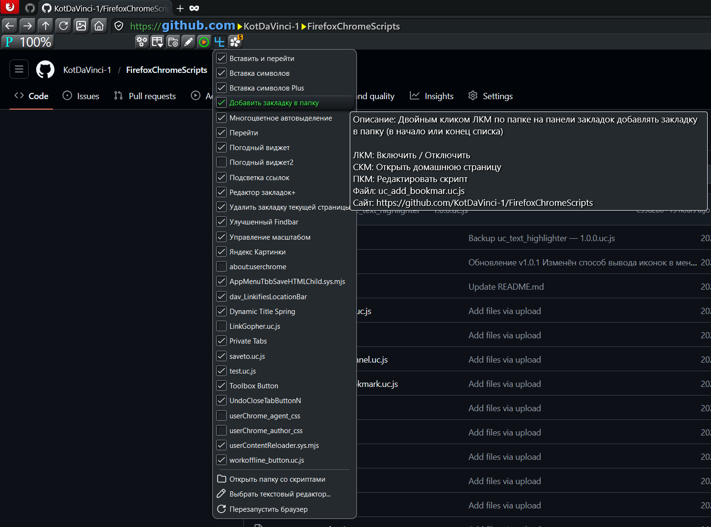

Выбор текстового редактора:

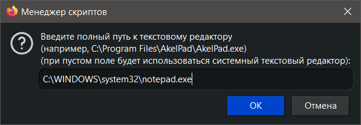

---

## Управление масштабом `uc_zoom_control.uc.js`
Кнопка для управления масштабом страницы.
* [Ссылка на страницу](userChromeJS/uc_zoom_control.uc.js)
* [Ссылка на raw](https://raw.githubusercontent.com/KotDaVinci-1/FirefoxChromeScripts/main/userChromeJS/uc_zoom_control.uc.js)
### Управление:
- **ЛКМ** — 100%.
- **Прокрутка колёсиком** — изменить масштаб.
- **СКМ** — переключить режим масштабирования (страница/текст).
- **ПКМ** — сменить оформление кнопки (4 варианта).
Дополнительно поддерживает отображение текущего масштаба (опционально).

    
Скрины с примерами режимов работы кнопки

P/PAGE - масштаб всей страницы. T/TEXT - масштаб текста.

Тёмная тема:

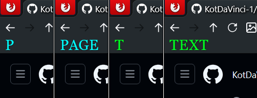
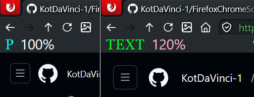

Светлая тема:

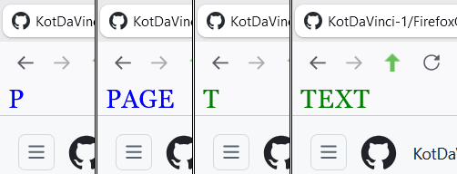
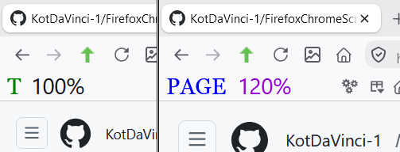

Кастомные кнопки:

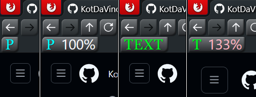

---

## Вставить и перейти `uc_paste_and_go.uc.js`
Кнопка для открытия содержимого буфера обмена в новой вкладке.
* [Ссылка на страницу](userChromeJS/uc_paste_and_go.uc.js)
* [Ссылка на raw](https://raw.githubusercontent.com/KotDaVinci-1/FirefoxChromeScripts/main/userChromeJS/uc_paste_and_go.uc.js)
### Управление:
- **ЛКМ по кнопке** — открыть содержимое буфера обмена в новой вкладке.
- **Ctrl+Shift+V** — выполнить то же действие (можно отключить).
- **СКМ по адресной строке** — выполнить то же действие (можно отключить).

### Особенности:
- Горячую клавишу и клик СКМ по адресной строке можно отключить в настройках скрипта.
- Для горячей клавиши поддерживается список доменов-исключений.
- Содержит патч совместимости с `dav_LinkifiesLocationBar.uc.js`.

---

## Яндекс Картинки `uc_yandex_images.uc.js`
Пример кнопки-закладки для открытия заранее заданного адреса.
* [Ссылка на страницу](userChromeJS/uc_yandex_images.uc.js)
* [Ссылка на raw](https://raw.githubusercontent.com/KotDaVinci-1/FirefoxChromeScripts/main/userChromeJS/uc_yandex_images.uc.js)
### Управление:
- **ЛКМ** — открыть ссылку в новой активной вкладке.
- **СКМ** — открыть ссылку в новой фоновой вкладке.

### Особенности:
- Скрипт можно использовать как шаблон для создания собственных кнопок-закладок.
- Для изменения назначения достаточно заменить `URL`, `label`, `ICON_URL` (можно просто использовать ссылку на favicon сайта), `ID` и `@name`.
- Количество таких кнопок не ограничено — достаточно создать копию скрипта с новыми параметрами.

---

## Перейти `uc_go_button.uc.js`
Постоянно доступный аналог кнопки **«Перейти»** из адресной строки.
* [Ссылка на страницу](userChromeJS/uc_go_button.uc.js)
* [Ссылка на raw](https://raw.githubusercontent.com/KotDaVinci-1/FirefoxChromeScripts/main/userChromeJS/uc_go_button.uc.js)
### Управление:
- **ЛКМ** — выполнить переход по адресу, указанному в адресной строке.
### Особенности:
- Может использоваться для повторного перехода по текущему адресу, например к якорю (`#...`) на странице.

---

## Подсветка ссылок `uc_link_highlighter.uc.js`
Подсвечивает ссылки в зависимости от их типа.
* [Ссылка на страницу](userChromeJS/uc_link_highlighter.uc.js)
* [Ссылка на raw](https://raw.githubusercontent.com/KotDaVinci-1/FirefoxChromeScripts/main/userChromeJS/uc_link_highlighter.uc.js)
### Управление:
- **ЛКМ** — включить/выключить подсветку.

### Особенности:
- **Красный** — внешние ссылки.
- **Синий** — ссылки внутри сайта.
- **Зелёный** — ссылки внутри страницы.
- Подсветка автоматически применяется к открываемым страницам, пока кнопка включена.

    
 Пример работы кнопки 

Кнопка отключена:

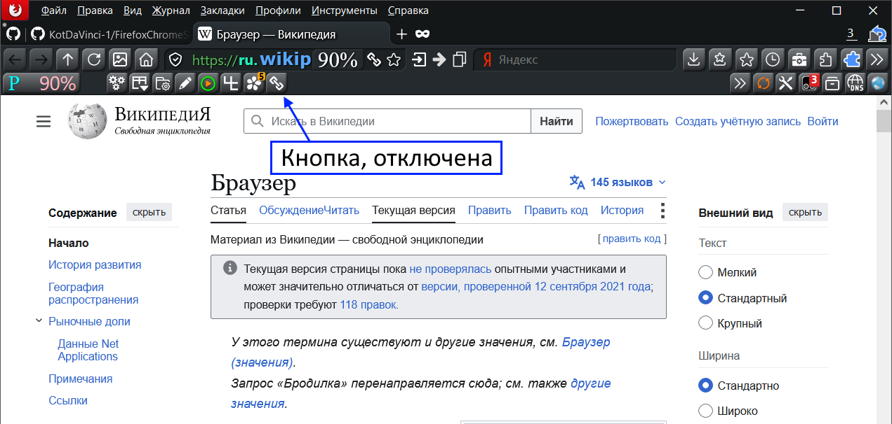

Кнопка включена:

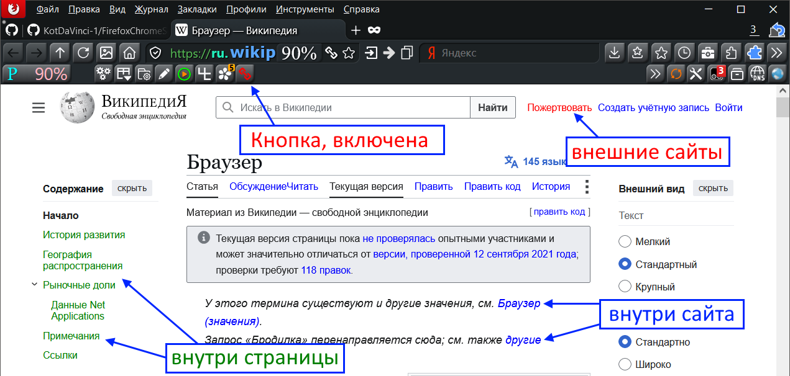

---

## Улучшенный Findbar `uc_findbar_func.uc.js`
Добавляет в панель поиска дополнительные функции и улучшает её поведение.
* [Ссылка на страницу](userChromeJS/uc_findbar_func.uc.js)
* [Ссылка на raw](https://raw.githubusercontent.com/KotDaVinci-1/FirefoxChromeScripts/main/userChromeJS/uc_findbar_func.uc.js)
### Управление:
- **Колёсико над панелью поиска** — переход к следующему/предыдущему совпадению.
- **ЛКМ по кнопке** — вставить текст из буфера обмена.
- **СКМ по кнопке** — использовать выделенный на странице текст.
- **ПКМ по кнопке** — очистить поле поиска.

### Особенности:
- Добавляет в панель поиска кнопку для работы с поисковым запросом.
- Общий Файндбар для всех вкладок (опционально, настройка в скрипте).
- Повторное нажатие **Ctrl+F** закрывает панель поиска (опционально, настройка в скрипте).
- Кнопка закрытия Файндбара перенесена в левую часть панели.

    
 Скрины 

Кнопки:

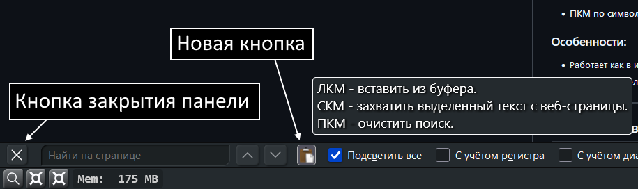

Переход к следующему/предыдущему совпадению прокруткой колёсиком в любом месте Файндбара:

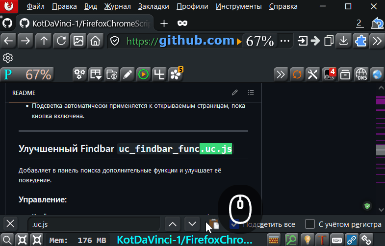

---

## Удалить закладку текущей страницы `uc_context_remove_bookmark.uc.js`
Добавляет в контекстное меню страницы пункт для удаления закладок текущей страницы.
* [Ссылка на страницу](userChromeJS/uc_context_remove_bookmark.uc.js)
* [Ссылка на raw](https://raw.githubusercontent.com/KotDaVinci-1/FirefoxChromeScripts/main/userChromeJS/uc_context_remove_bookmark.uc.js)
### Управление:
- **ПКМ по странице → «Удалить эту страницу из закладок»** — удалить все закладки, ведущие на текущую страницу.

### Особенности:

- Пункт меню отображается только для страниц, уже добавленных в закладки.
- Расположение пункта меню настраивается в скрипте.
- После удаления отображается уведомление со списком папок, из которых были удалены закладки.

    
 Скрины 

После панели навигации:

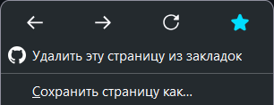

До панели навигации:

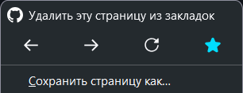

Внутри панели навигации:

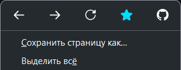

Уведомление:

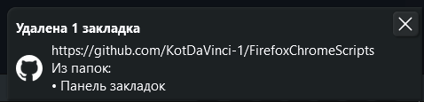

---

## Редактор закладок+ `uc_resizableBookmarkPanel.uc.js`
Улучшает панель редактирования закладок.
* [Ссылка на страницу](userChromeJS/uc_resizableBookmarkPanel.uc.js)
* [Ссылка на raw](https://raw.githubusercontent.com/KotDaVinci-1/FirefoxChromeScripts/main/userChromeJS/uc_resizableBookmarkPanel.uc.js)
### Возможности:
- Изменяемый размер панели с сохранением между запусками.
- Автоматическое раскрытие дерева папок.
- Позволяет редактировать адрес закладки.
- Добавляет в панель поддержку ключевых слов для закладок.

    
 Скрины 

Новая панель редактирования закладок:

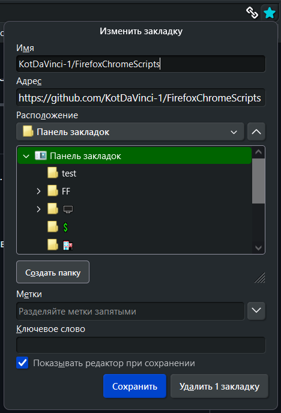

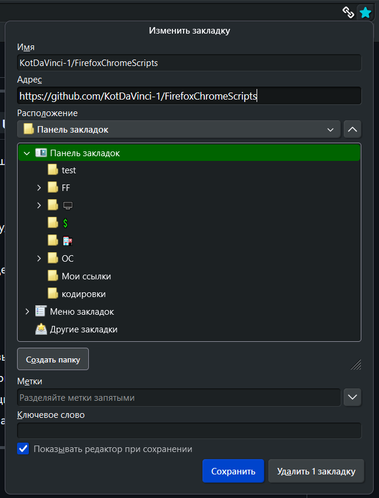

Старая панель редактирования закладок:

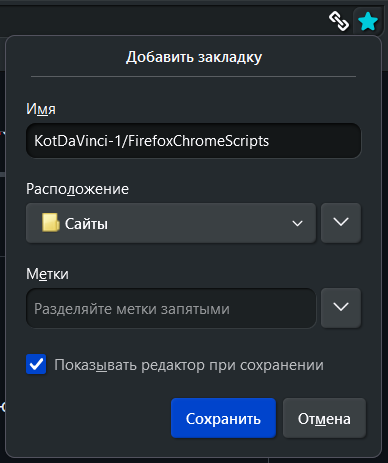

---

## Вставка символов `uc_insert_symbols.uc.js`
Кнопка с меню специальных символов и эмодзи.
* [Ссылка на страницу](userChromeJS/uc_insert_symbols.uc.js)
* [Ссылка на raw](https://raw.githubusercontent.com/KotDaVinci-1/FirefoxChromeScripts/main/userChromeJS/uc_insert_symbols.uc.js)
### Управление:
- **ЛКМ по кнопке** — открыть меню символов.
- **СКМ по кнопке** — открыть Таблицу символов Windows.
- **ЛКМ по символу** — вставить символ.
- **ПКМ по символу** — вставить символ, не закрывая меню.

### Особенности:
- Работает как в интерфейсе Firefox, так и на веб-страницах.
- Набор и расположение символов легко настраиваются в скрипте массиве `columns`

    
 Скрины 

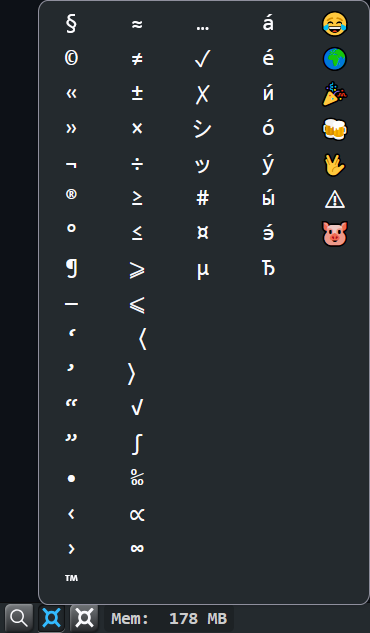

---

## Вставка символов Plus `uc_insert_symbols_plus.uc.js`
Расширенная версия скрипта **«Вставка символов»**. Помимо вставки отдельных символов позволяет вставлять готовые текстовые шаблоны и использовать содержимое буфера обмена.
* [Ссылка на страницу](userChromeJS/uc_insert_symbols_plus.uc.js)
* [Ссылка на raw](https://raw.githubusercontent.com/KotDaVinci-1/FirefoxChromeScripts/main/userChromeJS/uc_insert_symbols_plus.uc.js)
### Основные возможности:
- Все возможности скрипта **«Вставка символов»**.
- Вставка готовых фраз и многострочных шаблонов.
- Поддержка макроса `{CLIPBOARD}` для вставки содержимого буфера обмена в шаблон.
- Отдельные подписи (`disp`) и вставляемый текст (`ins`) для пунктов меню.
- Просмотр полного текста шаблона во всплывающей подсказке.

### Управление:
- **ЛКМ по кнопке** — открыть меню.
- **СКМ по кнопке** — открыть «Таблицу символов» Windows.
- **ЛКМ по пункту** — вставить текст.
- **ПКМ по пункту** — вставить текст без закрытия меню.

    
 Скрины 

В подсказку выводится то, что будет вставлено при клике.

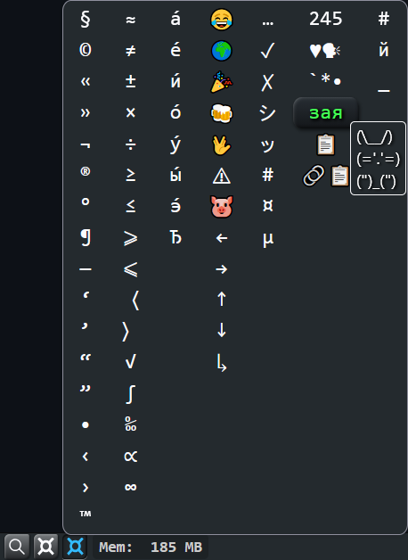

---

## Многоцветное автовыделение `uc_text_highlighter.uc.js`
* [Ссылка на страницу](userChromeJS/uc_text_highlighter.uc.js)
* [Ссылка на raw](https://raw.githubusercontent.com/KotDaVinci-1/FirefoxChromeScripts/main/userChromeJS/uc_text_highlighter.uc.js)
Скрипт для одновременной подсветки произвольных слов и фраз на веб-страницах несколькими цветами. 

Использует современный **CSS Custom Highlight API**: подсветка накладывается поверх уже отрисованного текста без изменения DOM. Благодаря этому сохраняется работоспособность ссылок и форматирования, а поиск корректно находит фразы, даже если они пересекают разные HTML-теги.

### Основные возможности
- **Многопоточность:** несколько независимых слотов поиска, работающих одновременно, каждый со своим цветом.
- **Поддержка Unicode:** корректная работа с кириллицей, латиницей, эмодзи и любыми другими символами.
- **Гибкость:** настраиваемая чувствительность к регистру (Aa) и диакритическим знакам (ä).
- **Визуализация:** цветные маркеры совпадений рядом с полосой прокрутки (аналогично стандартному `Ctrl+F`, но для всех слотов сразу).
- **Умное обновление:** подсветка автоматически обновляется при переключении вкладок, дозагрузке страниц или изменении искомых слов.
- **Надежность:** все настройки и тексты слотов сохраняются в `about:config`.

### Управление (Кнопка на панели)
Всё управление осуществляется через одну кнопку. Во время работы подсветки её иконка плавно меняет цвета.
На бейдже кнопки всегда отображается номер и цвет **активного слота**.

- **ЛКМ:** Включить / выключить подсветку на всех вкладках. *(После запуска браузера подсветка всегда выключена).*
- **СКМ:** Записать выделенный на странице текст в активный слот (заменив старый).
- **Прокрутка колёсиком:** Переключить активный слот (работает при наведении на кнопку или её меню).
- **ПКМ:** Открыть меню управления.

### Меню управления
Открывается по ПКМ на кнопке и позволяет:
- **ЛКМ по слоту:** открыть окно ручного ввода/редактирования текста.
- **СКМ по слоту:** скопировать текст слота в буфер обмена.
- **Чекбоксы:** быстро переключать учет регистра и диакритики.
- **Очистка:** удалить текст из всех слотов одной кнопкой (пустые слоты в поиске не участвуют).

### Настройки и ограничения
- Поиск является литеральным (регулярные выражения не поддерживаются).
- Количество слотов и их цвета задаются внутри кода скрипта (в массиве `COLORS`). 
- Максимальная длина текста для одного слота по умолчанию — **50 символов** (можно изменить в коде скрипта). При превышении лимита выводится уведомление.

    
 Скрины 

Пример подсветки:

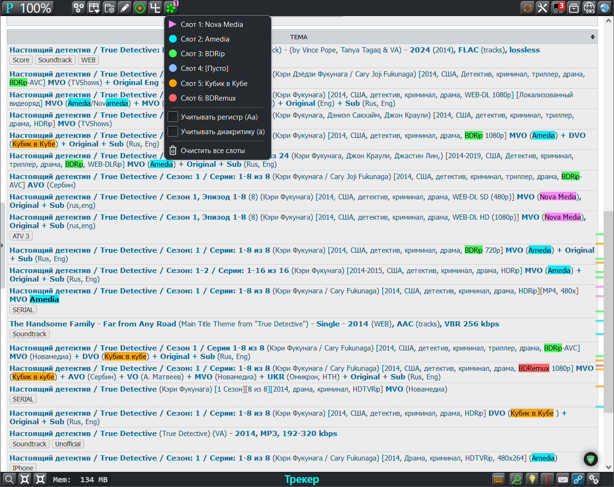

Работа диакритики и регистра:

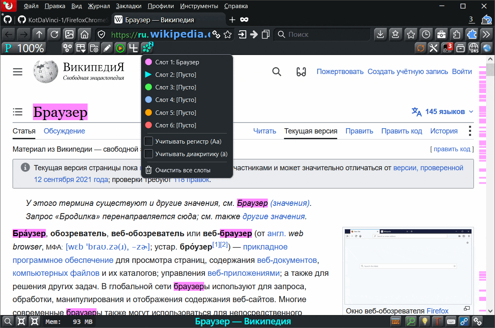

---

## Добавить закладку в папку `uc_add_bookmar.uc.js`
Добавляет текущую страницу в выбранную папку на панели закладок.
* [Ссылка на страницу](userChromeJS/uc_add_bookmar.uc.js)
* [Ссылка на raw](https://raw.githubusercontent.com/KotDaVinci-1/FirefoxChromeScripts/main/userChromeJS/uc_add_bookmar.uc.js)
### Управление:

- **Двойной ЛКМ по папке на панели закладок** — добавить текущую страницу в эту папку.

### Особенности:

- Закладка может добавляться в начало или конец папки (настраивается в скрипте).
- После добавления отображается краткое уведомление.
